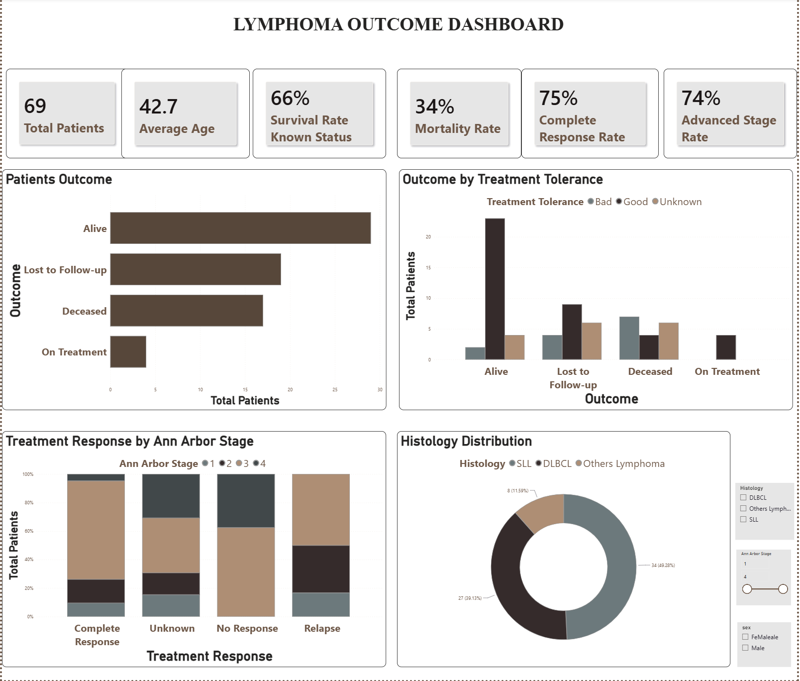

# Lymphoma Patient Outcome Analysis: Statistical Analysis and Interactive Dashboard
## Project Overview
This project analyzes clinical and demographic factors associated with patient survival in lymphoma patients using descriptive statistics, Chi-square tests, logistic regression, and interactive Power BI dashboard.
## Objectives
-	Explore the clinical characteristics of lymphoma patients.
-	Describe patient demographics, disease stage, histology, and treatment response.
-	Assess association between variables using chi-square tests.
-	Identify factors associated with patient survival using logistic regression.
-	Present the results through an interactive Power BI dashboard.
## Dataset
-	Study population: 69 anonymized lymphoma patients.
-	Variables: age, sex, histology, Ann Arbor stage, treatment tolerance, treatment response, and patient outcome.
## Key Findings
-	The overall logistic regression model was statistically significant (Likelihood Ratio
Test, p= 0.0025). 
-	Male sex was associated with lower odds of survival.
-	Advanced Ann Arbor stages (III and IV) were associated with lower odds of survival
-	Treatment response was significantly associated with patient outcome (Chi-square test, 
p <0.001)
-	Treatment tolerance was significantly associated with patient outcome (Chi-square test, 
p =0.002)
-	Quasi-complete separation was observed for the "No Response" category; therefore, this coefficient should be interpreted with caution. 
## Skills Demonstrated
-	Clinical data cleaning
-	Exploratory Data Analysis (EDA)
-	Statistical hypothesis testing (Chi-square)
-	Logistic regression modeling
-	Clinical data interpretation
-	Data visualization with Power BI
-	Python (Pandas, NumPy, Matplotlib, SciPy, Statsmodels)
## Dashboard Preview

